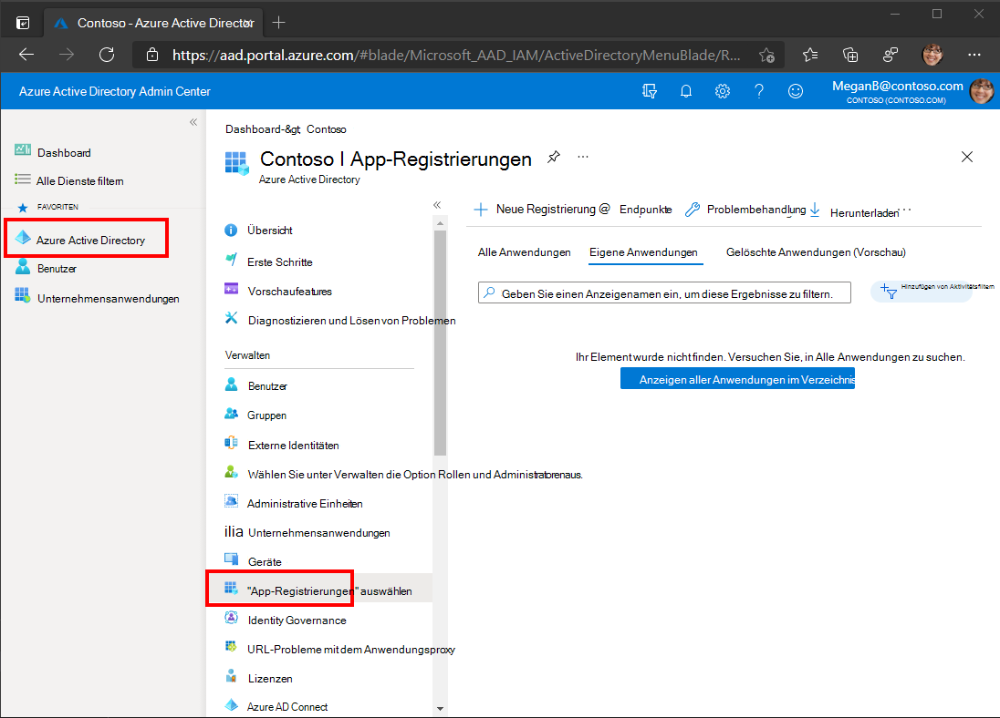
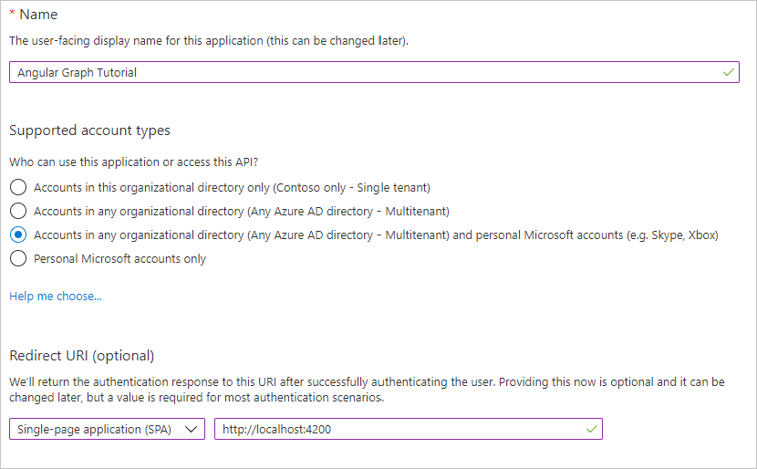

<!-- markdownlint-disable MD002 MD041 -->

In dieser Übung erstellen Sie eine neue Azure AD-Webanwendungsregistrierung mit dem Azure Active Directory Admin Center.

1. Öffnen Sie einen Browser, und navigieren Sie zum [Azure Active Directory Admin Center](https://aad.portal.azure.com). Melden Sie sich mit einem **persönlichen Konto** (auch: Microsoft-Konto) oder einem **Geschäfts- oder Schulkonto** an.

1. Wählen Sie in der linken Navigationsleiste **Azure Active Directory** aus, und wählen Sie dann **App-Registrierungen** unter **Verwalten** aus.

    

1. Wählen Sie **Neue Registrierung** aus. Legen Sie auf der Seite **Anwendung registrieren** die Werte wie folgt fest.

    - Legen Sie **Name** auf `Angular Graph Tutorial` fest.
    - Legen Sie **Unterstützte Kontotypen** auf **Konten in allen Organisationsverzeichnissen und persönliche Microsoft-Konten** fest.
    - Legen Sie unter **Umleitungs-URI** die erste Dropdownoption auf `Single-page application (SPA)` fest, und legen Sie den Wert auf `http://localhost:4200` fest.

    

1. Wählen Sie **Registrieren** aus. Kopieren Sie auf der Seite Angular **Graph Tutorial** den Wert der **Anwendungs-ID (Client-ID),** und speichern Sie sie, sie benötigen Sie im nächsten Schritt.

    
