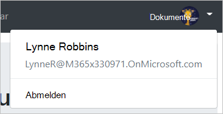

<!-- markdownlint-disable MD002 MD041 -->

In dieser Übung erweitern Sie die Anwendung aus der vorherigen Übung, um die Authentifizierung mit Azure AD zu unterstützen. Dies ist erforderlich, um das erforderliche OAuth-Zugriffstoken zum Aufrufen von Microsoft Graph zu erhalten. In diesem Schritt werden Sie die [Microsoft-Authentifizierungsbibliothek für eckig](https://github.com/AzureAD/microsoft-authentication-library-for-js/blob/dev/lib/msal-angular/README.md) in die Anwendung integrieren.

Erstellen Sie eine neue Datei im `./src` Verzeichnis mit `oauth.ts` dem Namen, und fügen Sie den folgenden Code hinzu.

```TypeScript
export const OAuthSettings = {
  appId: 'YOUR_APP_ID_HERE',
  scopes: [
    "user.read",
    "calendars.read"
  ]
};
```

Ersetzen `YOUR_APP_ID_HERE` Sie durch die Anwendungs-ID aus dem Anwendungs Registrierungs Portal.

> [!IMPORTANT]
> Wenn Sie die Quellcodeverwaltung wie git verwenden, wäre es jetzt ein guter Zeitpunkt, die Datei `oauth.ts` aus der Quellcodeverwaltung auszuschließen, um unbeabsichtigtes Auslaufen ihrer APP-ID zu vermeiden.

Öffnen `./src/app/app.module.ts` Sie und fügen Sie `import` die folgenden Anweisungen am Anfang der Datei hinzu.

```TypeScript
import { MsalModule } from '@azure/msal-angular';
import { OAuthSettings } from '../oauth';
```

Fügen Sie dann `MsalModule` das dem `imports` Array innerhalb der `@NgModule` Deklaration hinzu, und initialisieren Sie es mit der APP-ID.

```TypeScript
imports: [
  BrowserModule,
  AppRoutingModule,
  NgbModule,
  FontAwesomeModule,
  MsalModule.forRoot({
    clientID: OAuthSettings.appId
  })
],
```

## <a name="implement-sign-in"></a>Implementieren der Anmeldung

Definieren Sie zunächst eine einfache `User` Klasse, die die Informationen zu dem Benutzer enthält, der von der App angezeigt wird. Erstellen Sie eine neue Datei im `./src/app` Ordner mit `user.ts` dem Namen, und fügen Sie den folgenden Code hinzu.

```TypeScript
export class User {
  displayName: string;
  email: string;
  avatar: string;
}
```

Erstellen Sie nun einen Authentifizierungsdienst. Wenn Sie einen Dienst dafür erstellen, können Sie ihn einfach in alle Komponenten einfügen, die Zugriff auf Authentifizierungsmethoden benötigen. Führen Sie den folgenden Befehl in der CLI aus.

```Shell
ng generate service auth
```

Nachdem der Befehl abgeschlossen ist, öffnen `./src/app/auth.service.ts` Sie die Datei, und ersetzen Sie den Inhalt durch den folgenden Code.

```TypeScript
import { Injectable } from '@angular/core';
import { MsalService } from '@azure/msal-angular';

import { AlertsService } from './alerts.service';
import { OAuthSettings } from '../oauth';
import { User } from './user';

@Injectable({
  providedIn: 'root'
})
export class AuthService {
  public authenticated: boolean;
  public user: User;

  constructor(
    private msalService: MsalService,
    private alertsService: AlertsService) {

    this.authenticated = false;
    this.user = null;
  }

  // Prompt the user to sign in and
  // grant consent to the requested permission scopes
  async signIn(): Promise<void> {
    let result = await this.msalService.loginPopup(OAuthSettings.scopes)
      .catch((reason) => {
        this.alertsService.add('Login failed', JSON.stringify(reason, null, 2));
      });

    if (result) {
      this.authenticated = true;
      // Temporary placeholder
      this.user = new User();
      this.user.displayName = "Adele Vance";
      this.user.email = "AdeleV@contoso.com";
    }
  }

  // Sign out
  signOut(): void {
    this.msalService.logout();
    this.user = null;
    this.authenticated = false;
  }

  // Silently request an access token
  async getAccessToken(): Promise<string> {
    let result = await this.msalService.acquireTokenSilent(OAuthSettings.scopes)
      .catch((reason) => {
        this.alertsService.add('Get token failed', JSON.stringify(reason, null, 2));
      });

    // Temporary to display token in an error box
    if (result) this.alertsService.add('Token acquired', result);
    return result;
  }
}
```

Nachdem Sie nun über den Authentifizierungsdienst verfügen, kann er in die Komponenten injiziert werden, die sich anmelden. Beginnen Sie mit `NavBarComponent`dem. Öffnen Sie `./src/app/nav-bar/nav-bar.component.ts` die Datei, und nehmen Sie die folgenden Änderungen vor.

- Fügen `import { AuthService } from '../auth.service';` Sie am Anfang der Datei hinzu.
- Entfernen Sie `authenticated` die `user` Eigenschaften and aus der Klasse, und entfernen Sie den Code, in `ngOnInit`dem Sie festgelegt werden.
- Injizieren Sie `AuthService` den, indem Sie den folgenden Parameter `constructor`hinzu `private authService: AuthService`fügen:.
- Ersetzen Sie zunächst die vorhandene `signIn`-Methode durch Folgendes:

    ```TypeScript
    async signIn(): Promise<void> {
      await this.authService.signIn();
    }
    ```

- Ersetzen Sie zunächst die vorhandene `signOut`-Methode durch Folgendes:

    ```TypeScript
    signOut(): void {
      this.authService.signOut();
    }
    ```

Wenn Sie fertig sind, sollte der Code wie folgt aussehen.

```TypeScript
import { Component, OnInit } from '@angular/core';

import { AuthService } from '../auth.service';

@Component({
  selector: 'app-nav-bar',
  templateUrl: './nav-bar.component.html',
  styleUrls: ['./nav-bar.component.css']
})
export class NavBarComponent implements OnInit {

  // Should the collapsed nav show?
  showNav: boolean;

  constructor(private authService: AuthService) { }

  ngOnInit() {
    this.showNav = false;
  }

  // Used by the Bootstrap navbar-toggler button to hide/show
  // the nav in a collapsed state
  toggleNavBar(): void {
    this.showNav = !this.showNav;
  }

  async signIn(): Promise<void> {
    await this.authService.signIn();
  }

  signOut(): void {
    this.authService.signOut();
  }
}
```

Da Sie die `authenticated` Eigenschaften und `user` für die Klasse entfernt haben, müssen Sie die `./src/app/nav-bar/nav-bar.component.html` Datei auch aktualisieren. Öffnen Sie die Datei, und nehmen Sie die folgenden Änderungen vor.

- Ersetzen Sie alle Instanzen von `authenticated` durch `authService.authenticated`.
- Ersetzen Sie alle Instanzen `user` von `authService.user`mit.

Aktualisieren Sie als `HomeComponent` nächstes die Klasse. Nehmen Sie dieselben Änderungen an der `./src/app/home/home.component.ts` `NavBarComponent` Klasse vor, die Sie mit den folgenden Ausnahmen vorgenommen haben.

- Es gibt keine `signOut` Methode in der `HomeComponent` -Klasse.
- Ersetzen Sie `signIn` die-Methode durch eine etwas andere Version. Dieser Code ruft `getAccessToken` zum Abrufen eines Zugriffstokens auf, das für den Moment das Token als Fehler ausgeben wird.

    ```TypeScript
    async signIn(): Promise<void> {
      await this.authService.signIn();

      // Temporary to display the token
      if (this.authService.authenticated) {
        let token = await this.authService.getAccessToken();
      }
    }
    ```

Wenn Sie fertig sind, sollte die Datei wie folgt aussehen.

```TypeScript
import { Component, OnInit } from '@angular/core';
import { AuthService } from '../auth.service';

@Component({
  selector: 'app-home',
  templateUrl: './home.component.html',
  styleUrls: ['./home.component.css']
})
export class HomeComponent implements OnInit {

  constructor(private authService: AuthService) { }

  ngOnInit() {
  }

  async signIn(): Promise<void> {
    await this.authService.signIn();

    // Temporary to display the token
    if (this.authService.authenticated) {
      let token = await this.authService.getAccessToken();
    }
  }
}
```

Erstellen Sie schließlich dieselben ersetzen `./src/app/home/home.component.html` , die Sie für die Navigationsleiste vorgenommen haben.

Speichern Sie Ihre Änderungen, und aktualisieren Sie den Browser. Klicken Sie auf die Schaltfläche **Klicken Sie hier, um sich anzumelden** , und Sie sollten zu `https://login.microsoftonline.com`umgeleitet werden. Melden Sie sich mit Ihrem Microsoft-Konto an, und stimmen Sie den angeforderten Berechtigungen zu. Die APP-Seite sollte aktualisiert werden, wobei das Token angezeigt wird.

### <a name="get-user-details"></a>Abrufen von Benutzer Details

Der Authentifizierungsdienst legt im Moment Konstante Werte für den Anzeigenamen und die e-Mail-Adresse des Benutzers fest. Da Sie nun über ein Zugriffstoken verfügen, können Sie Benutzer Details aus Microsoft Graph abrufen, damit diese Werte dem aktuellen Benutzer entsprechen. Öffnen `./src/app/auth.service.ts` Sie und fügen Sie `import` die folgende Anweisung am Anfang der Datei hinzu.

```TypeScript
import { Client } from '@microsoft/microsoft-graph-client';
```

Fügen Sie eine neue Funktion zur `AuthService`-Klasse mit dem Namen `getUser` hinzu.

```TypeScript
private async getUser(): Promise<User> {
  if (!this.authenticated) return null;

  let graphClient = Client.init({
    // Initialize the Graph client with an auth
    // provider that requests the token from the
    // auth service
    authProvider: async(done) => {
      let token = await this.getAccessToken()
        .catch((reason) => {
          done(reason, null);
        });

      if (token)
      {
        done(null, token);
      } else {
        done("Could not get an access token", null);
      }
    }
  });

  // Get the user from Graph (GET /me)
  let graphUser = await graphClient.api('/me').get();

  let user = new User();
  user.displayName = graphUser.displayName;
  // Prefer the mail property, but fall back to userPrincipalName
  user.email = graphUser.mail || graphUser.userPrincipalName;

  return user;
}
```

Suchen und entfernen Sie den folgenden Code in `getAccessToken` der-Methode, die eine Warnung hinzufügt, um das Zugriffstoken anzuzeigen.

```TypeScript
// Temporary to display token in an error box
if (result) this.alertsService.add('Token acquired', result);
```

Suchen Sie den folgenden Code aus der `signIn` -Methode, und entfernen Sie ihn.

```TypeScript
// Temporary placeholder
this.user = new User();
this.user.displayName = "Adele Vance";
this.user.email = "AdeleV@contoso.com";
```

Fügen Sie an seiner Stelle den folgenden Code hinzu.

```TypeScript
this.user = await this.getUser();
```

In diesem neuen Code wird das Microsoft Graph-SDK verwendet, um die Details des Benutzers abzurufen `User` , und anschließend wird ein Objekt mithilfe der vom API-Aufruf zurückgegebenen Werte erstellt.

Ändern Sie nun `constructor` die für `AuthService` die-Klasse, um zu überprüfen, ob der Benutzer bereits angemeldet ist, und laden Sie die Details, falls dies der Fall ist. Ersetzen Sie das `constructor` vorhandene durch Folgendes.

```TypeScript
constructor(
  private msalService: MsalService,
  private alertsService: AlertsService) {

  this.authenticated = this.msalService.getUser() != null;
  this.getUser().then((user) => {this.user = user});
}
```

Entfernen Sie schließlich den temporären Code aus der `HomeComponent` -Klasse. Öffnen Sie `./src/app/home/home.component.ts` die Datei, und ersetzen `signIn` Sie die vorhandene Funktion durch Folgendes.

```TypeScript
async signIn(): Promise<void> {
  await this.authService.signIn();
}
```

Wenn Sie nun Ihre Änderungen speichern und die app starten, sollten Sie nach der Anmeldung wieder auf der Startseite enden, aber die Benutzeroberfläche sollte sich ändern, um anzugeben, dass Sie angemeldet sind.


Klicken Sie in der oberen rechten Ecke auf den Avatar des Benutzers, um auf den **Abmelde** Link zuzugreifen. Durch Klicken auf **Abmelden** wird die Sitzung zurückgesetzt, und Sie kehren zur Startseite zurück.



## <a name="storing-and-refreshing-tokens"></a>Speichern und Aktualisieren von Token

Zu diesem Zeitpunkt verfügt Ihre Anwendung über ein Zugriffstoken, das in der `Authorization` Kopfzeile von API-aufrufen gesendet wird. Dies ist das Token, das es der App ermöglicht, im Namen des Benutzers auf Microsoft Graph zuzugreifen.

Dieses Token ist jedoch nur kurzlebig. Das Token läuft eine Stunde nach seiner Ausgabe ab. Da die APP die MSAL-Bibliothek verwendet, müssen Sie keine Token-Speicher-oder Aktualisierungslogik implementieren. Das `MsalService` Token wird im Browser Speicher zwischengespeichert. Die `acquireTokenSilent` Methode überprüft zuerst das zwischengespeicherte Token, und wenn es nicht abgelaufen ist, wird es zurückgegeben. Wenn es abgelaufen ist, wird eine automatische Anforderung an einen neuen abgerufen.
